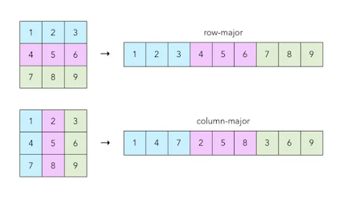

# GEMM v0

Implement one of the core computational primitives of modern LLMs — matrix multiplication in the form of [GEMM (general matrix multiplication)](https://en.wikipedia.org/wiki/Basic_Linear_Algebra_Subprograms#Level_3).
Specifically, compute:

$$
D_{m \times n} = \alpha A_{m \times k} \cdot B_{k \times n} + \beta C_{m \times n}
$$

Matrices $C$ and $D$ may alias in memory (in-place addition).

Each matrix can be stored in either row-major or column-major format:
.

Adjacent rows/columns may have gaps (strides) due to alignment requirements or because the matrix is a submatrix of a larger one.
Matrices $C$ and $D$ are guaranteed to share the same memory layout.

This task requires implementing the simplest version of GEMM **without** using shared memory.
Later tasks will optimize this naive solution.

Matrix elements have fp16 type, represented in CUDA as `__half` (include `cuda_fp16.h`).

## Useful links

- [Wikipedia: Half-precision floating-point format](https://en.wikipedia.org/wiki/Half-precision_floating-point_format).
- [CUDA documentation: `__half` type](https://docs.nvidia.com/cuda/cuda-math-api/cuda_math_api/struct____half.html).
- [Wikipedia: Row- and column-major order](https://en.wikipedia.org/wiki/Row-_and_column-major_order).
